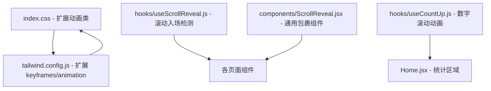

## 产品概述

对广州大学智能攻防课题组（IAD Lab / BinX）官方网站进行全面的视觉优化和交互美化，结合课题组"网络安全+AI攻防"的学术定位，打造具有科技感和专业感的现代化学术展示网站。

## 核心特性

### 1. Hero 区域重构 — 科技感视觉冲击

- 首页 Hero 区域增加深色渐变背景（深蓝/暗青配色），配合动态粒子/网格线动画，体现"网络安全"主题
- 统计数字区域添加数字滚动动画效果，增强数据展示的动态感

### 2. 全局滚动入场动画

- 为所有页面的 section 和卡片组件添加滚动进入视口时的渐入（fade-in）和上移（slide-up）动画
- 使用 Intersection Observer 实现轻量级滚动检测，避免引入重型动画库

### 3. 导航栏增强

- 导航栏滚动时添加毛玻璃背景效果（backdrop-blur），增加层次感
- 当前活跃链接添加底部指示条动画

### 4. 卡片与交互优化

- 研究方向卡片添加左侧彩色边框和 hover 时的渐变光效
- 成果页面卡片增加微交互动画：hover 时轻微上浮、边框颜色变化
- 团队成员卡片 hover 时头像微缩放效果

### 5. 页面级视觉优化

- 各页面标题区域添加装饰性背景元素（渐变色块或几何图形）
- 时间线（Events 页面）节点添加脉冲动画，增强时间流动感
- Gallery 页面 Lightbox 添加淡入淡出过渡动画
- "加入我们"页面欢迎区域增强视觉效果

### 6. Footer 优化

- Footer 添加深色背景，与网站科技感主题一致
- 增加微妙的渐变分隔线

## 技术栈

- **前端框架**：React 18 + React Router 6（保持现有）
- **样式**：Tailwind CSS 3.4（保持现有）
- **构建工具**：Vite 5（保持现有）
- **动画方案**：纯 CSS 动画 + 自定义 React Hook（Intersection Observer），不引入额外依赖
- **字体**：Inter + Noto Sans SC（保持现有）

## 实现方案

### 整体策略

采用"CSS 动画 + 自定义 Hook"的轻量方案，不引入 framer-motion 等重型动画库，保持项目零额外依赖的特点。所有动效通过 Tailwind CSS 自定义动画类 + 一个通用的 `useScrollReveal` Hook 实现。

### 关键技术决策

**1. 动画方案选择：纯 CSS + Intersection Observer**

- 理由：项目当前零动画依赖，引入 framer-motion（~40KB gzip）对于简单的入场动画过于重量级
- 方案：在 `tailwind.config.js` 中扩展 `keyframes` 和 `animation`，配合一个 `useScrollReveal` 自定义 Hook 检测元素进入视口
- 复杂度：O(n) 观察 n 个元素，Intersection Observer 原生高效，不触发 layout thrashing

**2. Hero 背景动画：CSS 渐变动画 + 装饰性 SVG**

- 不使用 Canvas/WebGL 粒子效果（过于复杂且影响性能），改用 CSS 渐变动画背景 + 静态 SVG 网格装饰图案
- 配合 CSS 动画使渐变缓慢流动，营造科技感同时保持极高性能

**3. 数字滚动动画：requestAnimationFrame 计数器**

- 自定义 `useCountUp` Hook，在元素进入视口时启动数字递增动画
- 使用 requestAnimationFrame 保证 60fps 流畅度

**4. 配色方案调整**

- 保持现有 primary 蓝色系作为主色调
- Hero 区域使用深蓝渐变（primary-800 → primary-900 → 近黑）
- 新增 accent 色（青色/蓝绿色 #06B6D4）作为点缀色，呼应"科技"氛围
- 统一所有页面的配色一致性

## 实现注意事项

### 性能保障

- 所有动画使用 `transform` 和 `opacity`，仅触发合成层（compositing），不触发重排重绘
- Intersection Observer 使用 `threshold: 0.1` 和 `rootMargin`，避免频繁回调
- 动画元素添加 `will-change: transform, opacity`，提示浏览器提前优化
- 滚动动画只触发一次（`once: true`），进入视口后取消观察

### 向后兼容

- 所有修改基于现有组件结构，不改变路由、数据流、组件层次
- 保持所有 CSS 类名约定，新增类名以 `animate-` 前缀区分
- 移动端响应式完全保留，动画在移动端适当简化（减少 Hero 装饰元素）

### 防止回归

- 不修改任何 JSON 数据文件
- 不改变组件 props 接口
- 不改变构建配置（vite.config.js）

## 架构设计

### 新增模块



### 数据流不变

所有动画效果仅在展示层（UI 层）添加，不影响任何数据层逻辑。

## 目录结构

```
src/
├── hooks/
│   ├── useScrollReveal.js    # [NEW] 滚动入场检测 Hook。基于 Intersection Observer，当目标元素进入视口时添加动画类。支持 threshold、rootMargin、once 等参数配置。返回 ref 供组件绑定。
│   └── useCountUp.js         # [NEW] 数字递增动画 Hook。接收目标数字和动画时长，在元素可见时使用 requestAnimationFrame 从 0 递增到目标值。支持解析 "50+" 格式的带后缀数字。
├── components/
│   ├── ScrollReveal.jsx      # [NEW] 通用滚动入场动画包裹组件。封装 useScrollReveal，提供 fade-up、fade-in、slide-left 等预设动画方向，支持 delay 和 duration 属性。简化页面中动画的使用。
│   ├── Navbar.jsx            # [MODIFY] 增加滚动时毛玻璃效果（backdrop-blur-md + bg-white/80）。监听 scroll 事件，滚动超过阈值时切换样式类。活跃链接添加底部蓝色指示条。
│   ├── Footer.jsx            # [MODIFY] 改为深色背景（bg-gray-900），文字颜色对应调整。添加顶部渐变分隔线。快速导航链接 hover 效果调整为亮色系。
│   └── Layout.jsx            # (不变)
├── pages/
│   ├── Home.jsx              # [MODIFY] Hero 区域：深蓝渐变背景 + CSS 动画流光效果 + 装饰性 SVG 网格图案 + 文字白色。统计数字区域：使用 useCountUp 实现滚动计数动画。各 section 使用 ScrollReveal 包裹实现入场动画。研究方向卡片添加左侧彩色边框和 hover 光效。课题组负责人卡片优化视觉层次。
│   ├── Achievements.jsx      # [MODIFY] 页面标题区域添加装饰性背景。竞赛获奖/论文/漏洞卡片添加 ScrollReveal 入场动画。卡片 hover 增加上浮 + 边框颜色变化微交互。Tab 切换添加过渡动画。
│   ├── Members.jsx           # [MODIFY] 各 section 使用 ScrollReveal 包裹。成员卡片 hover 时头像微缩放。毕业去向卡片增加入场动画和标签 hover 效果。
│   ├── JoinUs.jsx            # [MODIFY] 欢迎横幅区域增强为渐变背景 + 装饰图形。招募方向卡片添加 ScrollReveal 和 hover 上浮效果。福利卡片添加入场延迟动画。
│   ├── Events.jsx            # [MODIFY] 时间线节点添加 CSS 脉冲动画（pulse）。事件卡片使用 ScrollReveal 交替入场。媒体报道卡片添加 hover 过渡增强。
│   ├── Gallery.jsx           # [MODIFY] 活动卡片添加 ScrollReveal 瀑布流入场动画（带递增 delay）。Lightbox 添加淡入淡出过渡（opacity transition）。封面图 hover 增加暗色蒙层 + 查看提示。
│   └── Friends.jsx           # [MODIFY] 链接卡片使用 ScrollReveal 入场。卡片 hover 效果增强（轻微上浮 + 图标旋转）。
├── index.css                 # [MODIFY] 新增动画 keyframes 定义（fade-up、fade-in、slide-left、pulse-dot、gradient-flow、count-up 等）。新增动画工具类。更新 .card 基础类添加 transition-all。新增 Hero 区域专用样式类。
├── data/                     # (不变，所有 JSON 数据文件保持不变)
└── App.jsx                   # (不变)

tailwind.config.js            # [MODIFY] extend 中新增 keyframes（fadeUp、fadeIn、slideLeft、pulseGlow、gradientShift）和对应 animation 配置。新增 accent 色（cyan-500 #06B6D4）。新增 backdropBlur 工具类确认。
```

## 设计风格

采用"科技学术"风格，在保持原有简约专业基调的基础上，融入网络安全/AI攻防的科技氛围。通过深色渐变Hero、动态微交互、毛玻璃效果等现代设计元素，大幅提升视觉品质和用户体验。

## 页面设计

### 1. 首页（Home）

**Hero 区域**（顶部全宽）

- 深蓝到近黑的渐变背景（从左上到右下），配合缓慢流动的CSS渐变动画
- 右侧/背景添加半透明的网格线条SVG装饰图案，呈现电路板/网络节点风格
- 标题和描述文字为白色，副标题为蓝灰色半透明
- "认识团队"按钮为白色实底蓝字，"学术成果"按钮为白色边框半透明
- 整体营造深邃的技术感氛围

**统计数字区域**

- 保持分隔线布局，数字在进入视口时从0递增滚动到目标值
- 数字使用主色调蓝色，标签保持灰色

**课题组简介区域**

- 左侧文字 + 右侧信息卡片的双栏布局保持不变
- 信息卡片背景改为微妙的渐变效果（primary-50到白色）
- 整体区域使用 ScrollReveal 从下方渐入

**课题组负责人区域**

- 卡片左侧头像框添加蓝色光晕效果
- hover 时整体卡片微上浮，左侧出现蓝色边框指示

**研究方向区域**

- 每张卡片左侧添加 3px 宽的彩色边框（智能渗透-橙色、漏洞挖掘-紫色、大模型安全-绿色）
- hover 时边框宽度微扩展，卡片背景出现对应颜色的淡渐变

**最新动态区域**

- 时间标签使用小圆点 + 连接线风格
- 条目进入时从左侧滑入

### 2. 学术成果页（Achievements）

**页面顶部**

- 标题区域添加装饰性的半透明蓝色渐变色块作为背景

**Tab 栏**

- 切换时添加平滑过渡效果

**卡片列表**

- 每张卡片使用 ScrollReveal 从下方依次渐入（带递增延迟）
- hover 时卡片上浮 2px，左侧出现主色调边框
- 漏洞卡片网格保持现有布局，hover 时添加对应颜色（CVE红/CNVD蓝）的边框发光效果

### 3. 团队成员页（Members）

**成员卡片**

- hover 时头像区域微缩放（scale 1.05）
- 兴趣标签 hover 时轻微放大
- 各 section 使用 ScrollReveal 入场

**毕业去向**

- 保持现有设计，企业标签 hover 时添加弹性微动画

### 4. 课题组动态页（Events）

**时间线**

- 时间线节点圆点添加持续的脉冲动画（蓝色光圈扩散）
- 卡片使用 ScrollReveal 入场，左右交替产生视觉节奏感
- 媒体报道卡片 hover 时图标有微旋转效果

### 5. 团建风采页（Gallery）

**照片卡片**

- 使用 ScrollReveal 瀑布式入场动画，每张卡片有 50ms 递增延迟
- hover 时封面图上层出现半透明暗色蒙层 + "查看相册" 文字提示
- Lightbox 打开/关闭添加 opacity 过渡动画

### 6. 加入我们页（JoinUs）

**欢迎区域**

- 背景增强为蓝到青的渐变，添加装饰性几何图形（半透明圆形/方形）
- 文字调整为白色系

**卡片区域**

- 使用 ScrollReveal 入场，带递增延迟

### 7. 友情链接页（Friends）

**链接卡片**

- ScrollReveal 入场动画
- hover 时卡片上浮，链接图标有微旋转

## Agent Extensions

### SubAgent

- **code-explorer**
- 目的：在实施各页面修改前，深入探索各组件的详细实现和依赖关系，确保修改不引入回归
- 预期结果：准确定位所有需要修改的代码位置和样式类名，确保动画添加不破坏现有布局